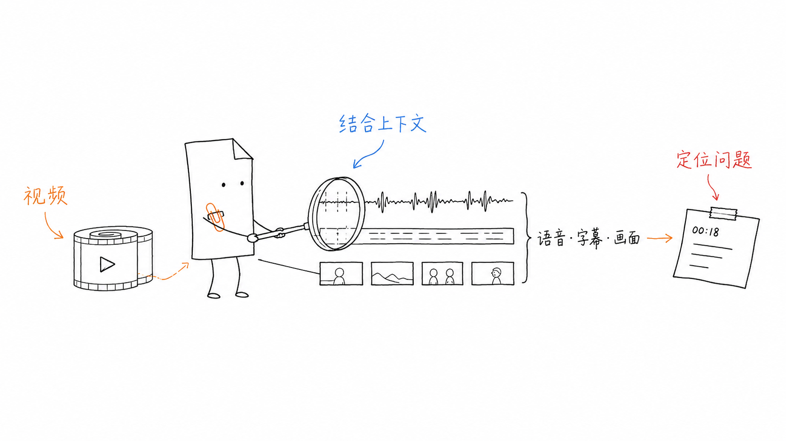
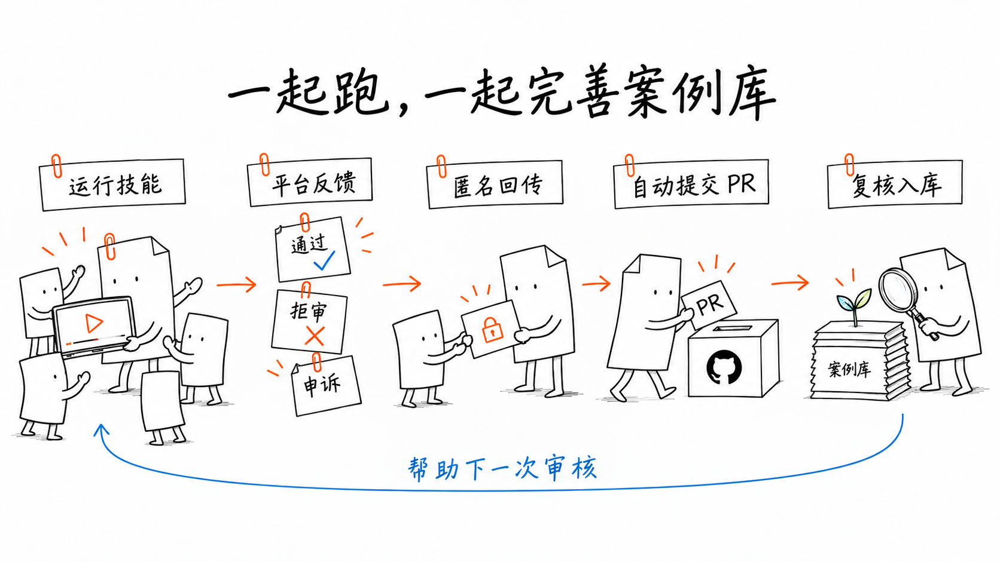

<div align="center">

# 过审 · guoshen

**视频发布前的风险预检，发布后的案例共建**

小红书 · 抖音 · B站 · 视频号

[使用指南](docs/usage.md) · [参与共建](docs/community.md) · [文档导航](docs/README.md)

</div>

## 发布前，先检查

联合检查语音、字幕与画面，按通用规则和目标平台规则定位风险，给出时间点、依据与修改建议。



安装到 Codex 技能目录；已有同名目录时请先备份：

```sh
git clone https://github.com/huangbai-AI/guoshen.git ~/.codex/skills/guoshen
```

新建对话，发送视频并输入：

> 用 $guoshen 检查这条视频在小红书、抖音、B站、视频号的发布风险，标出原文、时间点、依据和改法。

<details>
<summary>使用准备与检查范围</summary>

可指定单个平台，并说明投稿、商业合作、加热或带货等场景。本地提取需要 Python、FFmpeg、whisper.cpp 和多语言模型；画面文字识别使用 macOS Vision 与 Swift。工具安装、运行命令及其他系统的接入说明见 [使用指南](docs/usage.md)。

结论包含明确风险、需复核、按用户要求修改、未发现明显问题与未检查。缺少的材料、识别失败和抽样范围须在报告中注明，完整规范见 [AI审核流程](docs/ai-review.md)。

</details>

## 平台不同，分别判断

通用规则与单平台规则共同检查，保留来源、适用日期和待核实部分。


<details>
<summary>查看规则、来源与可选配置</summary>

- [通用检查清单](resources/rules/common/checklist.md)
- 平台指南：[小红书](resources/rules/platforms/xiaohongshu.md) · [抖音](resources/rules/platforms/douyin.md) · [B站](resources/rules/platforms/bilibili.md) · [视频号](resources/rules/platforms/wechat_channels.md)
- [来源台账](resources/references/sources.json) · [版本治理](docs/rule-lifecycle.md) · [个人配置](resources/profiles/README.md)

现有26条结构化检查规则与28个来源记录，来源记录不代表均已取得官方全文。具体获取状态和核实日期见各条记录，整理文件不会刷新核实日期。更多说明见 [审核流程与规则体系](docs/overview.md)。

</details>

## 发布后，一起完善

回传通过、拒审或申诉结果，助手整理匿名案例；获得公开授权后自动提交 PR，维护者复核入库，帮助下一次审核。



> 这是上次视频的实际平台反馈，请整理成匿名案例，确认后提交到 guoshen。

<details>
<summary>查看贡献方式与案例说明</summary>

自动提交需要可用的 GitHub 登录与提交环境。案例内容先确认再公开，不提交私人原片、账号信息、联系方式或未获授权截图。步骤见 [共建指南](docs/community.md)。

也可 [提交案例](https://github.com/huangbai-AI/guoshen/issues/new?template=case.yml) 或 [提议规则修订](https://github.com/huangbai-AI/guoshen/issues/new?template=rule-change.yml)。目前 [案例库](cases/README.md) 提供模拟填写示例，真实记录等待社区贡献；案例入库不会自动修改生效规则。

[贡献指南](.github/CONTRIBUTING.md) · [开发验证](docs/development.md) · [仓库结构](docs/README.md)

</details>

过审提供风险参考，不连接平台内部审核，也不保证发布通过。

[MIT 许可](LICENSE) · [第三方权利说明](docs/third-party-notices.md) · [更新记录](docs/changelog.md)
