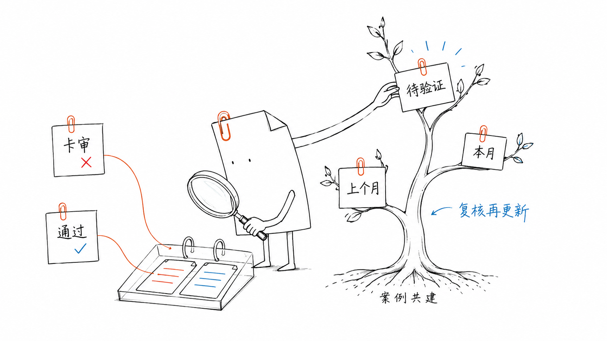

<div align="center">

# 过审 · guoshen

**面向视频创作者的开源审核预检技能**

小红书 · 抖音 · B站 · 视频号

[开始使用](docs/usage.md) · [参与共建](docs/community.md) · [查看文档](docs/README.md)

</div>

发布前，联合检查语音、字幕与画面，定位风险并提供修改建议。发布后，将平台的实际反馈回传为匿名案例，持续完善项目的审核参考。



## 快速开始

安装到 Codex 技能目录；已有同名目录时请先备份：

```sh
git clone https://github.com/huangbai-AI/guoshen.git ~/.codex/skills/guoshen
```

新建对话，发送视频并输入：

> 用 $guoshen 检查这条视频在小红书、抖音、B站、视频号的发布风险，标出原文、时间点、依据和改法。

可指定单个平台，并说明投稿、商业合作、加热或带货等场景。本地提取所需工具、模型和运行命令见 [使用指南](docs/usage.md)。

## 参与共建

每次真实的平台反馈，都能为后续审核提供参考。通过、拒审与申诉结果均可贡献。

在使用技能的对话中回传结果，助手会整理匿名案例。确认内容并授权公开后，助手自动向本仓库提交修改提案（PR）；维护者复核合并后，案例进入真实案例库。自动提交需要可用的 GitHub 登录与提交环境，完整流程见 [共建指南](docs/community.md)。

> 这是上次视频的实际平台反馈，请整理成匿名案例，确认后提交到 guoshen。

也可直接 [提交案例](https://github.com/huangbai-AI/guoshen/issues/new?template=case.yml) 或 [提议规则修订](https://github.com/huangbai-AI/guoshen/issues/new?template=rule-change.yml)。目前案例库提供模拟填写示例，真实记录等待社区贡献。

## 了解项目

| 文档 | 内容 |
| --- | --- |
| [审核流程与规则体系](docs/overview.md) | 视频证据、通用规则、平台差异与案例的作用 |
| [规则目录](rules/README.md) · [案例目录](cases/README.md) | 可复核的规则、来源与反馈记录 |
| [文档与仓库导航](docs/README.md) | 使用说明、目录用途及维护入口 |
| [贡献指南](.github/CONTRIBUTING.md) · [开发验证](docs/development.md) | 参与方式与现有检查 |

过审提供发布前风险参考，判断依据包括来源、适用日期与检查范围。它不连接平台内部审核，也不保证发布通过。案例与规则分开维护，案例入库不会自动更改生效规则。

原创代码和文档采用 [MIT 许可](LICENSE)。[第三方权利说明](docs/third-party-notices.md) · [更新记录](docs/changelog.md)
