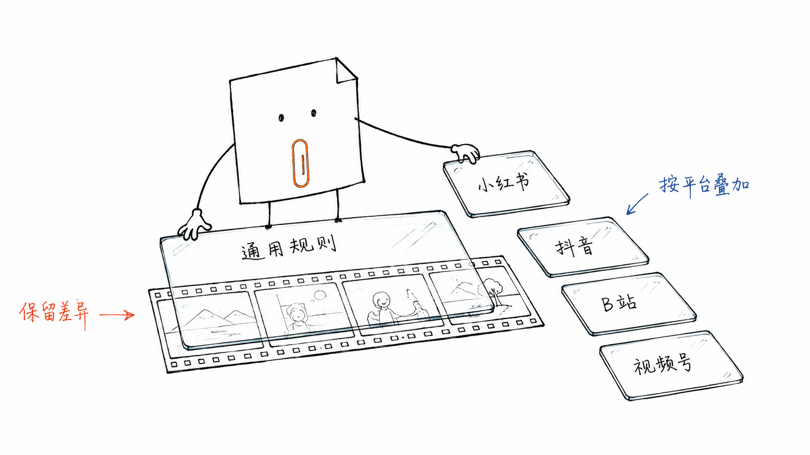

# 审核流程与规则体系

## 联合检查视频证据

语音、字幕和画面分别提取，保留原文、时间点、失败记录与检查覆盖；助手结合上下文和当次适用规则复核，输出风险定位与修改建议。支持小红书、抖音、B站、视频号，也可只选一个平台。投稿、广告、加热、带货、课程和直播分别处理。

输出包括明确风险、需复核、按用户要求修改、未发现明显问题、未检查。未取得的来源、缺少的材料和识别误差须在报告中注明。抽样识别不支持“全片没有网址”的结论，详细步骤见 [使用指南](usage.md) 和 [AI审核流程](ai-review.md)。

## 通用规则与平台规则

| 层级 | 内容 | 入口 |
| --- | --- | --- |
| 通用规则 | 违法危险、隐私、真实性、版权、广告、AI标识等58项检查问题 | [通用清单](../rules/common/checklist.md) |
| 平台规则 | 平台社区规则、导流、官方入口与专项场景 | [小红书](../rules/platforms/xiaohongshu.md) · [抖音](../rules/platforms/douyin.md) · [B站](../rules/platforms/bilibili.md) · [视频号](../rules/platforms/wechat_channels.md) |
| 来源与时间 | 官方正文、入口、二手资料分开；记录适用期与复核日期 | [来源台账](../references/sources.json) · [版本治理](rule-lifecycle.md) |
| 个人要求 | 可选的更保守发布偏好，不冒充官方禁令 | [公开默认](../references/user-profile.json) · [配置说明](../profiles/README.md) |

当前有26条结构化检查规则、28个来源记录。来源记录不等于28份已取得的官方全文；**视频号运营规范正文已核实，外链、直播、电商等专项仍须按场景补查**。来源缺口必须输出需复核，各条核查日期单独记录，整理仓库不会刷新旧来源的核查日期。

不把“小红书/抖音出现任何网址必违规”或“B站任何网址都允许”写成统一结论。需结合实际导流目的、官方挂载权限、商业场景和当期条款。严格地址模式只是用户可选要求。

## 案例怎样辅助判断

真实反馈进入 `cases/records/`，模拟填写示例保留在 `cases/examples/`。当前提供5个模拟示例，尚无真实公开案例；模拟示例不计入统计、不作为规则证据。“删掉一个内容后通过”只能支持假设，不能单独证明它就是拒审原因。

真实案例帮助复核同平台、同场景的判断，也保留通过与申诉反例。案例合并不会自动改变生效规则，规则修订需按 [版本治理](rule-lifecycle.md) 另行复核。

[文档导航](README.md) · [返回首页](../README.md)
